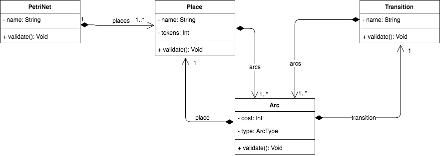

# Internal DSL for building Petri Nets

## Class Diagram

## Abstract Syntax

PetriNet &rarr; Place

Place &rarr; name token Transition

Transition &rarr; name (Ingoing | Outgoing)

Ingoing &rarr; cost (Transition | Place | end)

Outgoing &rarr; cost (Transition | Place | end)

## Static Semantics
 Builder Validation     Code Validation 

- A petri net
  - has a name (non-empty)
  -  consists of at least one place
  -  contains at least one transition

- A place
  -  has a name (unique, non-empty)
  -  has an initial amount of tokens (>= 0)
  -  has at least one ingoing arc from or one outgoing arc to a transition

- A transaction
  -  has a name (non-empty)
  - has at least one ingoing arc
  - has at least one outgoing arc  

- An arc
  - has a cost (>= 0)
  - has either an ingoing place and an outgoing transition or
    an ingoing transition and an outgoing place